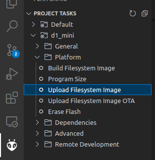

# VulnerableBeer

VulnerableBeer is a Vulnerable-by-Design IoT beer tender application. This version runs on a ESP8266 microcontroller, in this case a D1 mini pro. 

## Vulnerable-by-Design beer tender

### Hardware components
VulnerableBeer is an old beertender that is modified to accomodate a 'tapvat' (https://www.beerwulf.com/nl/p/bier/heineken-5l-tapvat). The lever of the 'tapvat' is operated by a servo (https://www.tinytronics.nl/shop/nl/mechanica-en-actuatoren/motoren/servomotoren/td-8130mg-waterproof-digitale-servo-30kg), which is controlled by a D1 mini pro (ESP8266) microcontroller (https://www.benselectronics.nl/wemos-d1-mini-pro.html). 

### Happy flow, ordering a beer
The happy flow of vulnerable beer is to order a beer after making a payment with Bitcoin over the lightning network. For this purpose, LNbits (https://lnbits.com) is used. LNbits is an open-source wallet system with various features to connect lightning wallets to devices.  

VulnerableBeer requires internet access. When VulnerableBeer is started for the first time, an open accesspoint is started (VulnerableBeer). When connected to this network, a web page should be opened with a menu to configure internet access. These settings are stored in the D1 mini so that when starting the next time, the network connection is automatically started. If the configured Wi-Fi network is not detected, the open accesspoint will be provided to reconfigure the wireless network.

Once connected to the internet, a WebSocket connection will be opened to 'legend.lnbits.com'. This is an open 'test' server of LNbits. A wallet in LNbits is configured to send a message via the WebSocket, when someone has payed for a beer. The payment URL is available in the QR code. This can be scanned with any modern Bitcoin wallet (Bluewallet, Wallet of Satoshi, ...).

After a succesfull payment, a message is sent over the WebSocket connection, the valve is opened, a beer is poured, and the valve is closed. 

### Serial interface
A serial command-line interface (CLI) is accessible through the USB connector of the D1 mini. Through the CLI commands can be entered, debug messages can be seen, etc. etc.

As a normal user, three commands are available: 'help', 'reboot' and 'admin'. To enter admin mode, the password has to be entered. The SHA1 hash of the password ('correcthorsebatterystaple') is hardcoded in the application. 

In admin mode, more commands are available. Type 'help' to see them. In this mode, a beer can be entered. 

### Web interface
The beer tap also operates a web interface. Initially only for configuring the Wi-Fi, but later on also as a welcome message with instructions. The web pages are stored in the 'data' directory of the project and stored in flash on the microcontroller.

## Compiling and flashing the firmware

 1. Install Visual Studio code
 2. Install the Platform IO extension. 
    1. Open VSCode Extension Manager
    2. Search for official PlatformIO IDE extension
    3. Install PlatformIO IDE.
 3. In Visual Studio code, open the command palette (Ctrl-Shift-P) and type 'gitcl'.
 4. When prompted for the repository URL, enter the URL of this repository: git@github.com:pieterjm/VulnerableBeer.git
 5. Select a local directrory where to store the repository and open the repository.
 6. Click the checkmark icon in the blue bar at the bottom to compile the repository. This may take a while as external libraries have to be loaded.
 7. Connect the D1 mini microcontroller to a USB port and click the Arrow button in the blue bar at the bottom to compile and flash the firmware on the D1 mini. 
 8. To flash the filesystem to the microcontroller, click the PlatformIO (alien) icon on the left in Visual Studio. Expand 'd1_mini' and 'Platform' and click 'Build Filesystem Image' and 'Flash Filesystem Image'. Make sure that the serial monitor is disabled to prevent upload errors.

 9. After flashing is complete, open the serial monitor, to access the serial CLI of the D1 mini, enter Ctrl-Alt-S
 
 
 
 
  
